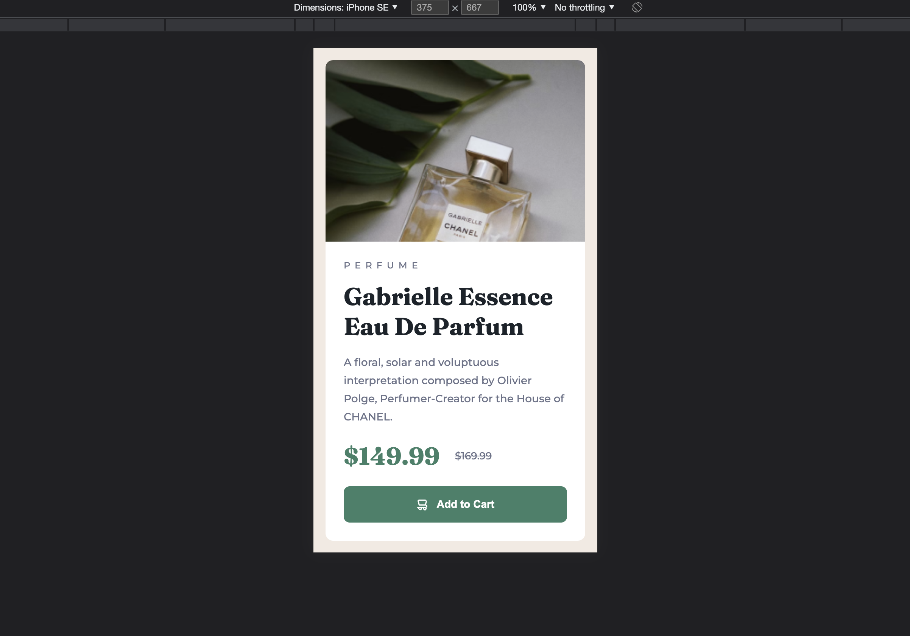

# Product Preview Card Component Project

> Third Frontend Mentor challenge in which I put into practice my knowledge of responsive design to adapt a purchase card component from the web to the mobile.

[🔗 Click here to access the website](https://matheusvaz-dev.github.io/product-preview-card-component/)

## 🛠️ Technologies

- HTML;
- CSS;
- Responsive design.

## 📧 Contact

matheusvaz.ux@gmail.com
